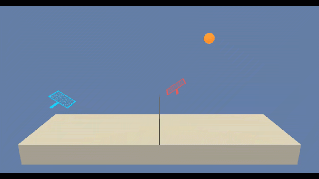

### Udacity Deep Reinforcement Learning Nanodegree:

# Project 3: Collaboration and Competition


## Introduction

Let there be an agent with a racket it can move along its side of the court between the net and the baseline. In addition, it can ”jump”, i.e. move the racket up and down. The angle of the racket with respect to court is fixed. The goal of the agent is to play volley with another agent for as many counts as possible. 

The project is based on Unity's Tennis environment.




## Project Details

#### Project Environment
The project is implemented as a 4 layer neural network. The network is specified in the file `model.py`. The agent is implemented in the file `ddpg_agent.py`, and the notebook `Cooperation Competition UniModel.ipynb` provides the interactive code to train an untrained agent in self-play. 

#### State Space
Each agent's observation space has 243 dimensions, and each feature vector describes an observation of the following 8 components as a sequence of three consecutive timesteps:
- Racket:
  - local position $(x, y)$
  - velocity $(v_x, v_y)$
- Ball
  - local position $(x, y)$
  - velocity $(v_x, v_y)$

The input layer, thus, has 4 observations with 2 coordinates each for 3 timesteps for two agents, $4 \cdot2 \cdot 3 \cdot 2 = 48$ neurons for the continuous input space. 

#### Action Space
The action space has two actions for each one of the two agents $2 \cdot 2 = 4$ continuous action values.

#### Rewards
A reward of $+0.1$ is provided for each time the agent managed to return the ball without hitting it out of bounds, and a negative reward or punishment of $-0.1$ is applied otherwise.

#### Goal
The task is episodic. The agent must get an average score of $0.5$ over 100 consecutive episodes.


## Getting Started
The repository was developed and tested in a 64-bit Windows 10 virtual machine running Ubuntu 18.04 on an Intel Core i7-7700 CPU with dual NVIDIA GeForce GTX 1080.  

Unfortunately, the GPU passthrough for the cirtual machine could not be activated, and the CPU had to do all the work.

#### Dependencies
The same virtual environment as in project 1 and 2 was used.

#### Udacity Project Repository
Download the [project's repository](https://github.com/udacity/deep-reinforcement-learning/tree/master/p3_collab_competl) from Udacity's GitHub page if you like to re-implement the project yourself.
The Linux environment can be downloaded [here](https://s3-us-west-1.amazonaws.com/udacity-drlnd/P3/Tennis/Tennis_Linux.zip). The project's GitHub page contains links to download it for operating systems other than Linux.

## Instructions
Make sure the `Tennis.x86_64` and the folder `Tennis_Data` from your environment are in your project directory, together with the `model.py`,  the `maddpg_agent.py`,  the `training.py`, and the `utils.py` files and the `Cooperation Competition UniModel.ipynb` notebook:
```text
Tennis_Data
Tennis.x86_64
Cooperation Competition Environment.ipynb
Cooperation Competition Synopsis.ipynb
Cooperation Competition UniModel.ipynbddpg_agent.py
mdddpg_agent.py
model.py
readme.md
training.py
unity-environment.log
utils.py
```
The file `unity-environment.log` is (re-)created when running the notebook and does not exist initially.
A `result` folder may or may not exist. This is where trained models are stored, each in its own folder `model x` where x is an auto-incremented number.

Within the model folder, the following files are stored:

```
checkpoint_actor_0.pth
checkpoint_actor_1.pth
checkpoint_critic_0.pth
checkpoint_critic_1.pth
config.json
scores.csv
scores.png
```
The `pth` checkpoint files can be used to run a trained agent. The `json` file contains the model parameters used to train the agent plus the count of episodes needed to reach the target of 0.5. The `csv` file contains the raw score per episode, the moving average and the standard deviation calculated over a window of 100. Finally, a plot of the raw score, the moving average and the $\pm1$ standard deviation band around it is saved as a `png`.


#### Running the Code
To start the notebook server, open a terminal and navigate to your project directory or a parent thereof, then enter
```commandline
jupyter notebook
```
The jupyter environment is opened in your standard browser. You might have to navigate to the project directory, then start `Cooperation Competition UniModel.ipynb` to train a specific model. Run the individual cells in sequence by clicking `SHIFT ENTER` in each or restart and run the kernel through the menu.

#### Overriding the Default Configuration
The configuration is predefined in the `utils.py` file. The number of agents, the hidden layer depth and various other model parameters can be overriden.

#### Exploring the Environment
If you want to explore the environment's and the brain's variables and their types and shapes, use the notebook `Cooperation Competition Environment.ipynb`

#### Training the Agents
Instantiate the `Config` object and override, for example, the `fc1_units`, `fc2_units`, and the `gamma` value.  If you want your model to be stored in a specific `model x` folder where you specify `x`, set the `model_id_auto` to `false` and set `model_id` to `x`. This will create a model directory within the `results` folder.

The configuration is then printed. An Agent object is instantiated using the configuration, and the scores, moving average and the standard deviation values are created by the `ddpg` method imported from the file `training.py`. These values are then plotted and the plot saved as a `png` together with the checkpoint files for actor and critic plus the `csv` file of the values in the model directory. 
